# Tredansen Curtains Shortening Guide

I dove into shortening the width of my Tredansen curtains with guidance from a [Reddit post](https://www.reddit.com/r/tradfri/comments/15hj3r2/ikea_tredansen_diy_guide_cut_complete_disassembly/) and a [Medium article](https://medium.com/@jared_1228/praktlysing-ikea-smart-blinds-cut-to-size-95d16a2315ef). After successfully shortening the first curtain, I did the same with the second, taking notes and photos along the way. Below, you can read these unedited notes and view the photos. Disclaimer: If you follow these steps, you are responsible for any potential damage to your curtains. This is simply a documentation of my process, not a recommendation.

## Disassembly Process
1. Insert the battery.
2. Fully extend the curtain.
3. Remove the battery.
4. Remove the bottom iron holder by detaching the plastic clip on one side and sliding it towards the other side until it comes off.
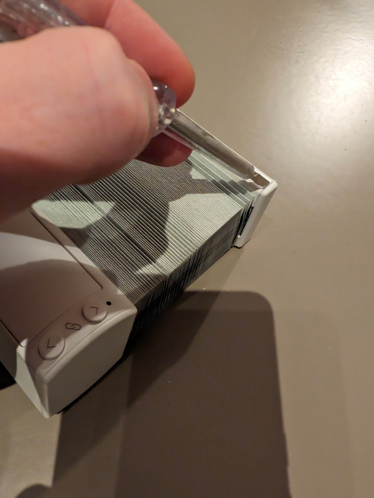
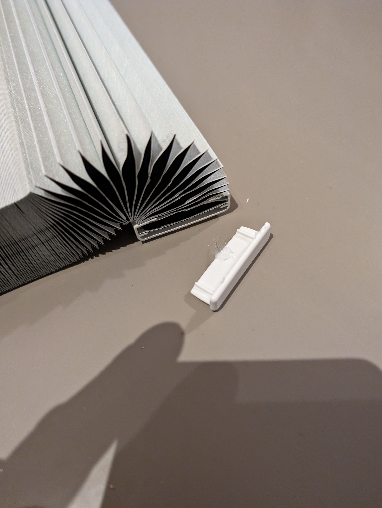

5. Remove the end cap on the side opposite to the battery.
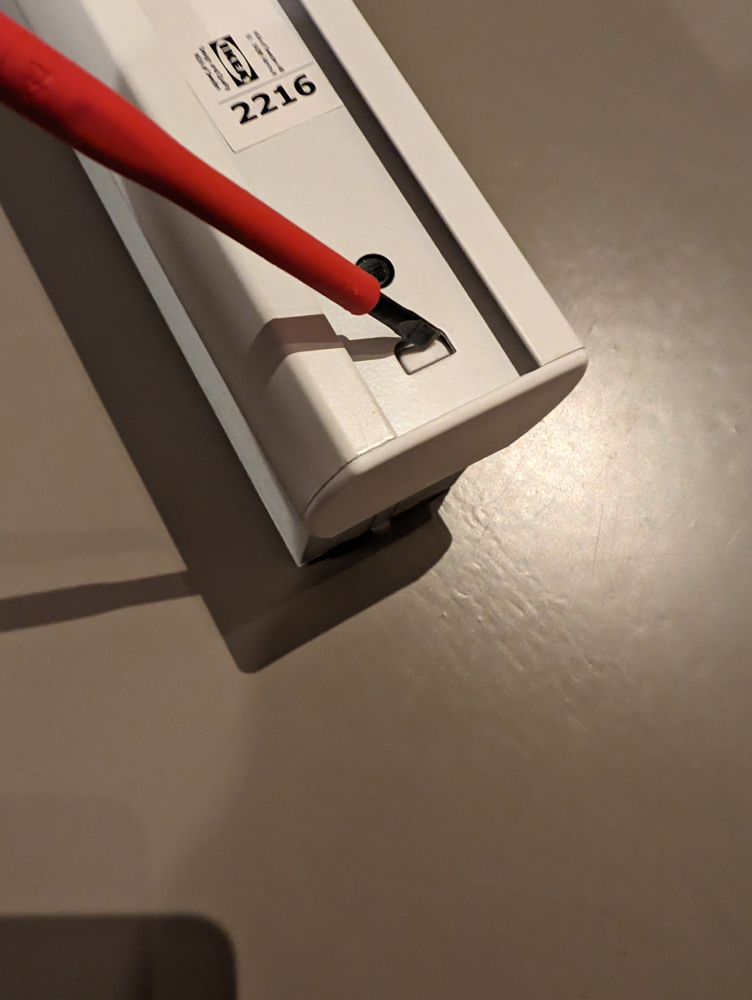

6. Slide the curtain out of the top part. The extended ropes should provide ample room. If not, loosen the rope knot at the bottom. We'll need to redo it anyway.
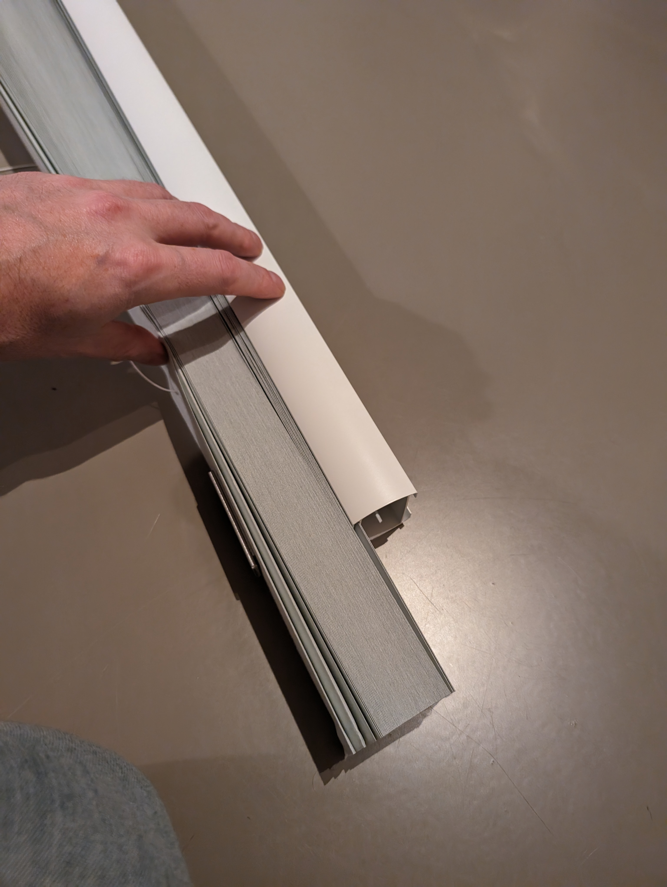

7. The rope might be tight inside the curtain, so gently pull it from the top side.

8. Remove the battery holder by unscrewing the two small screws on top.
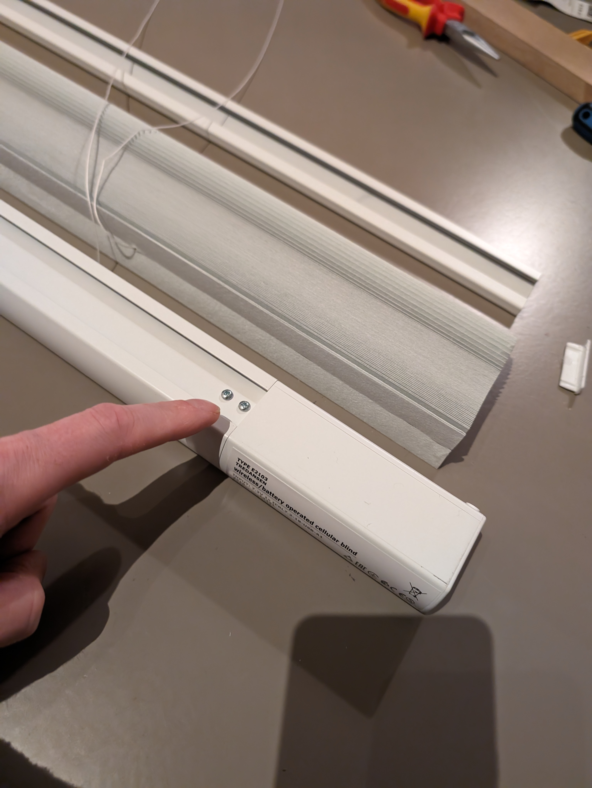

9. Gently slide out the battery compartment, still attached by a grey ribbon cable.

10. Disconnect the grey ribbon cable from the battery holder by gently pushing down on the top lip and pulling the cable out.

11. Remove the outermost motor bracket:
    - Push the black rubber mount on top (outside) until it dislodges slightly. Push down and towards the end with enough force.
    

    - Once slightly dislodged (see photo), use a screwdriver on one side of the bracket to remove it completely.
    
    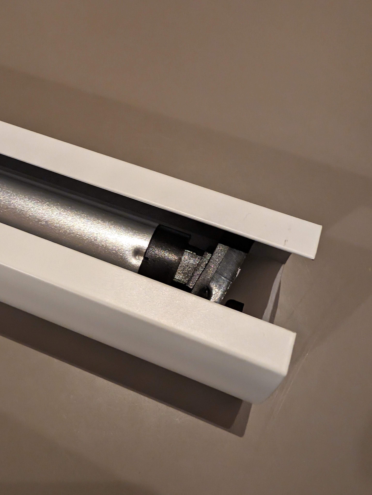
    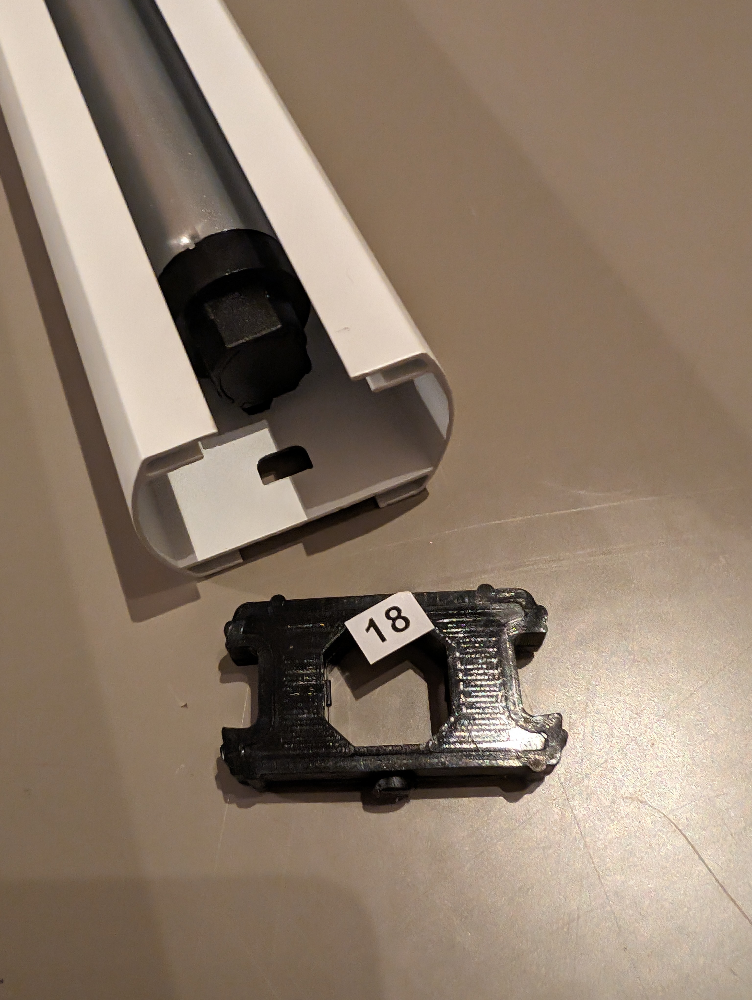

12. Remove the motor from the inner bracket. Apply force on the opposite end of the shaft. I used a small piece of wood sticking out from the assembly, placing the assembly on its side on the wood, and applying force to the top.

13. Loosen the shaft holder ring hex screw (or undo it enough so the ring can move freely along the shaft).

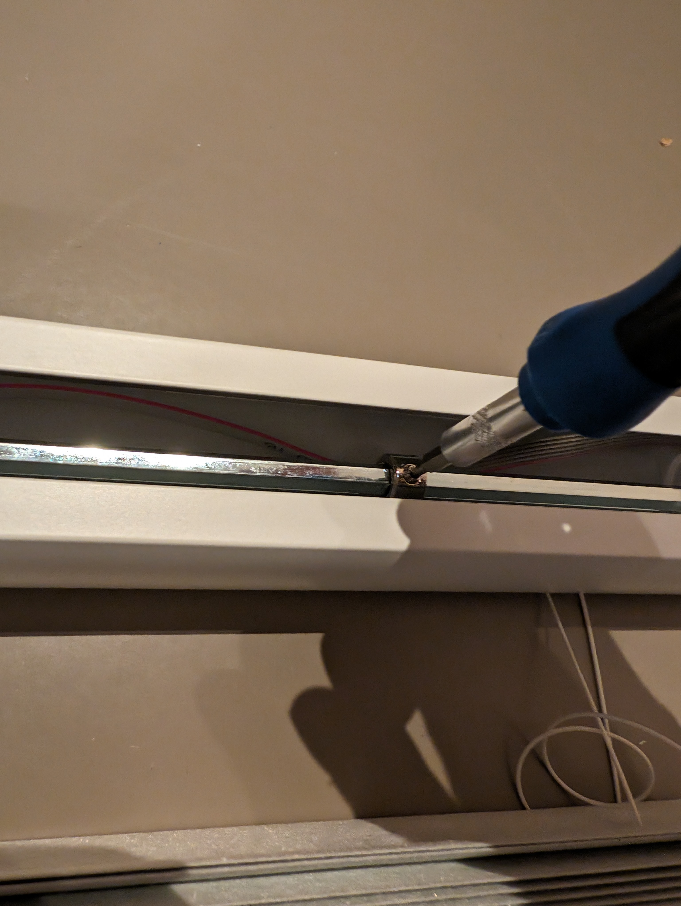

14. Pull out the entire motor, including the shaft.
15. Remove the shaft from the motor by pulling gently (it's a loose plastic fit).

16. Optionally, you can also disconnect the ribbon cable entirely.
17. Disassemble the two plastic rope spools, which are pressure fitted with a small plastic knob on top:
    - Get a piece of wood about 5cm wide that fits the assembly.
    
    
    

    - Position it near the plastic knob (located on the opposite end of the spool from where the rope exits). Ensure your finger fits between the wood and the spool.
    

    - Rotate the wood to slightly spread the assembly. Once spread enough, pull upward on the spool to release the plastic knob from the assembly.
    

    - Slide out the spool from the assembly on the battery holder side, spreading the assembly with the wood as needed.
    

    - Remove the other spool in the same manner, sliding it toward the battery holder side. It's also possible to leave it be. I thought it'd be best if no saw dust came into it.
    

18. Disassembly should now be complete (except for the inner motor bracket which I didn't remove at all).

## Shortening the width / cutting to size
1. Leave the motor side as is. All shortening of the top assembly is done on the battery holder side.
2. Measure the desired curtain length and subtract 11.2mm (accounting for the battery holder protrusion).

3. Cut the top assembly on the battery holder side to the total width minus the protruding part of the battery holder. Use a metal band saw for easy cutting.

4. Cut the bottom iron part of the curtain to the total width (subtract 4mm for the two plastic caps).

5. Drill two new 3.2mm holes (or 4.2mm, which also works) on the battery holder side of the assembly, one at 5mm from the end, and the other at 15mm. These are for attaching the battery holder.

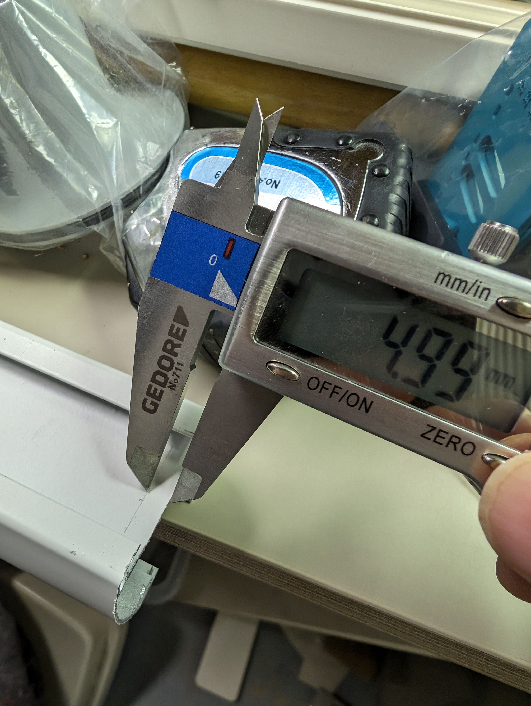

6. Temporarily place the battery holder (no need to screw it down) and measure 28cm from that side inward. Drill a new 6mm hole at this point (in the center). This hole will accommodate the plastic knob of the battery side spool.

7. Install the rope spool nearest to the motor in its original place.
8. Install the other rope spool, ensuring the plastic knob protrudes through the new hole.
9. Temporarily slide in the motor, including the shaft. Mark the point to cut the shaft, ensuring it extends 2-3cm between the spool nearest the battery holder and the battery holder itself.

10. Cut the shaft.
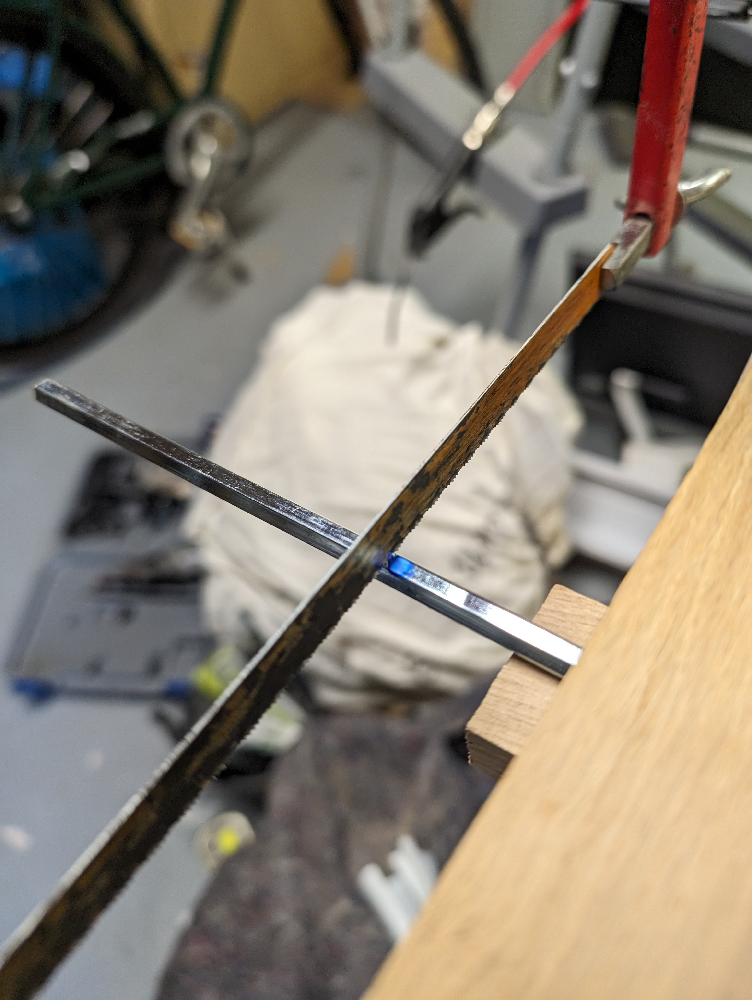

11. Reassemble the entire top part, remembering:
    - To place the shaft holder with the small hex screw between the spools, near but not touching the battery holder side spool.
    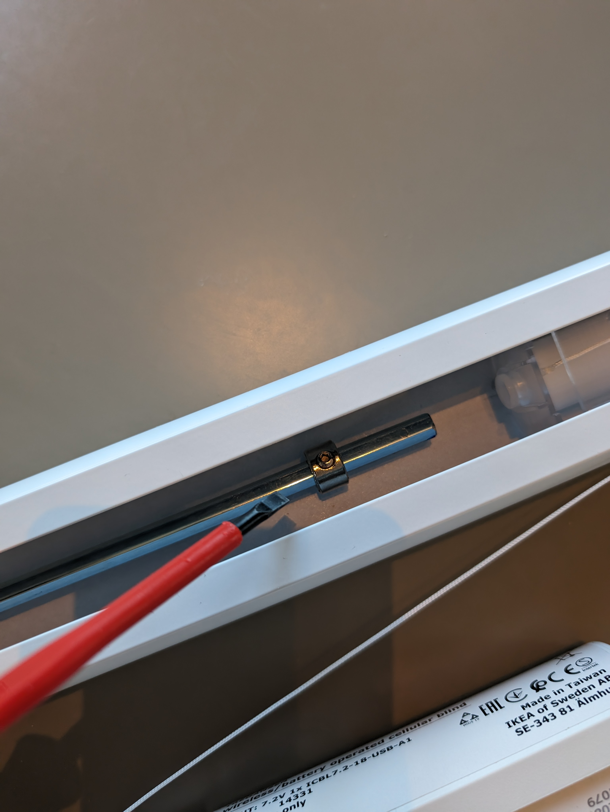

    - When replacing the motor, ensure the two indents in the motor align with the protrusions inside the motor bracket. It should click once in place. For the outer motor bracket, some force might be needed.
    
    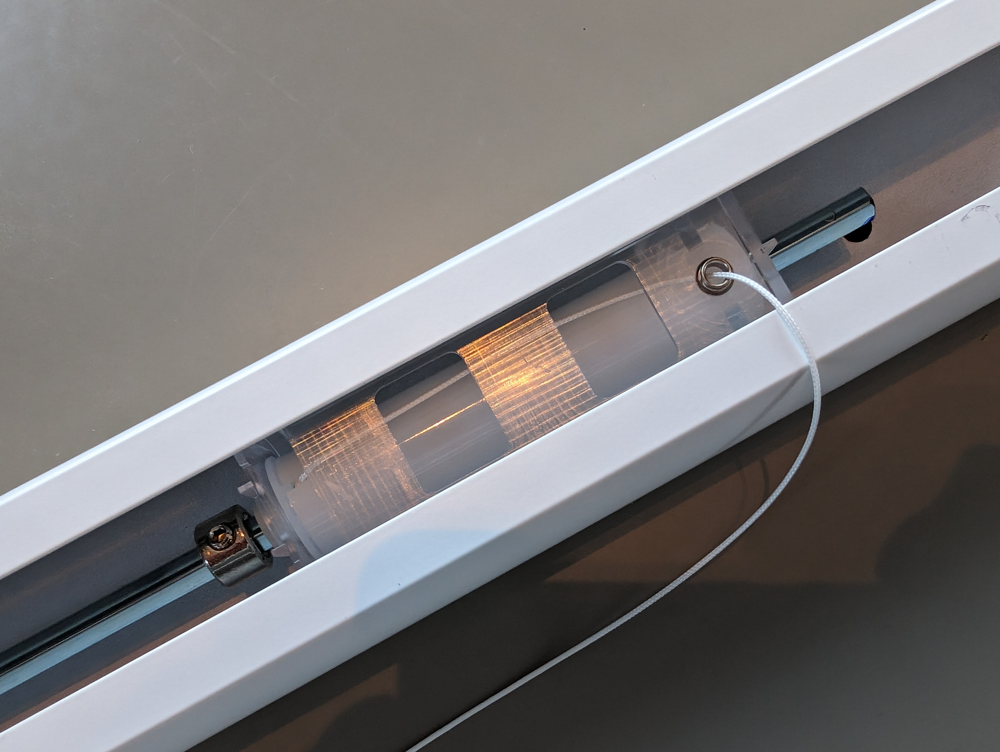
    

    - To guide the ribbon cable along the side of the iron assembly, using voids in the motor brackets and spools.
    

    - To make a small loop in the ribbon cable on the motor side, allowing extra length between the motor and the outer plastic clip.
    
    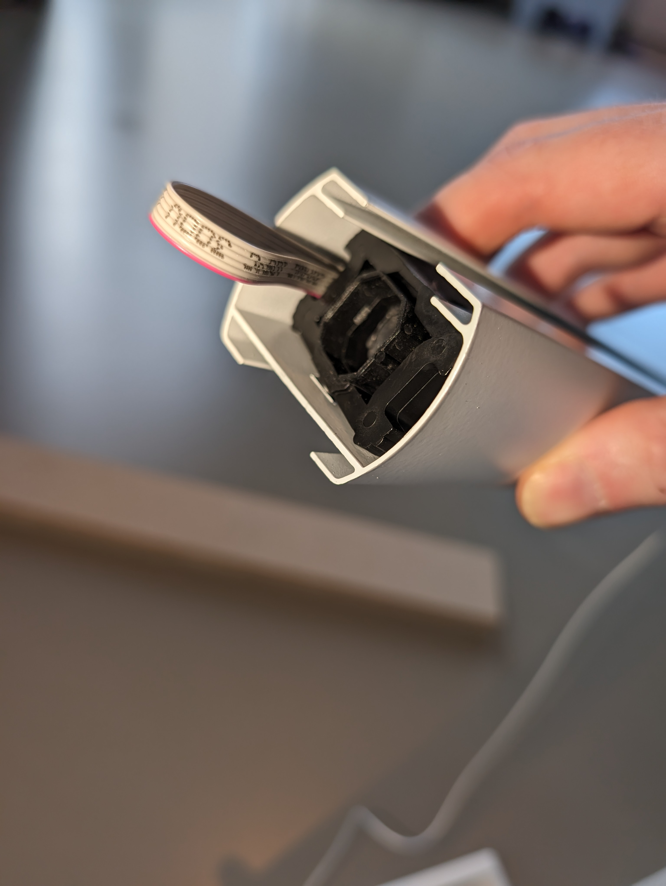

    - When connecting the battery holder with the battery inside, the motor will start pulling up the curtain. Apply force on the ropes to make it stop (the electronics will think it's fully pulled up) and revert the ropes to their fully extended position by pressing the buttons.
12. Cut the curtain to the exact width (total width minus 4mm for the end caps):
    - Measure the amount to trim.
    - Divide this by two.
    - Cut equal parts from both ends of the bottom weights, ensuring even distribution to prevent lopsidedness.
    - Bundle the curtain tightly and secure it with painter's tape. Cut through the tape and curtain with a small serrated knife for precision and to avoid melting the plastic.
    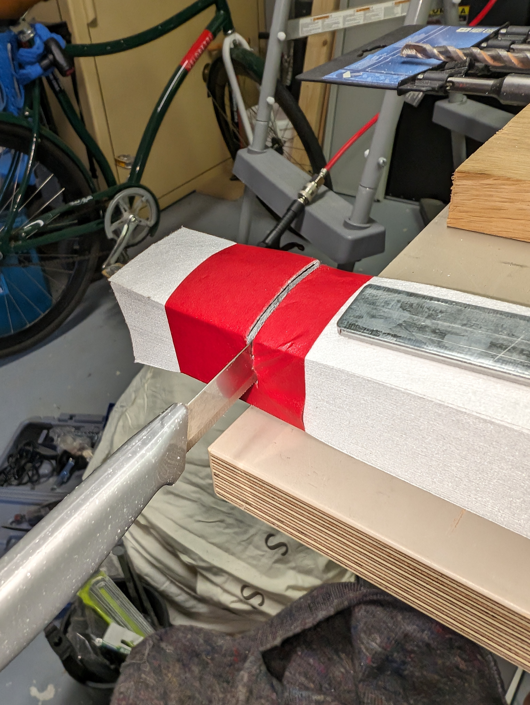

13. Align the curtain with the assembled top part and mark the new rope hole positions.
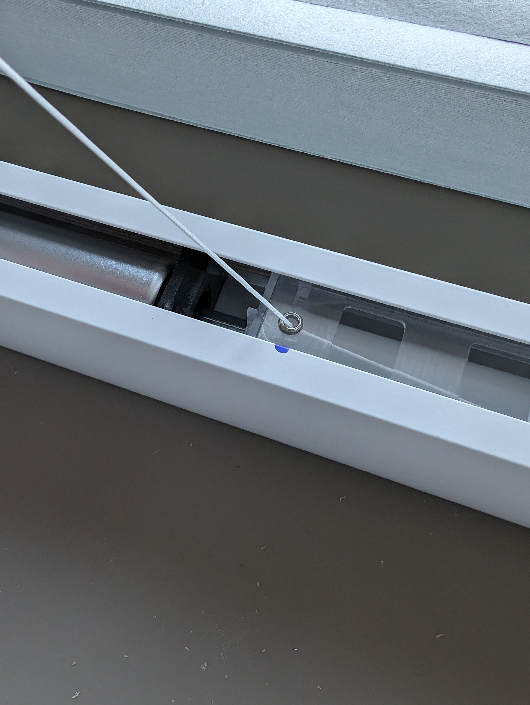

14. Drill two new rope holes in the center of the curtain at the marked locations, drilling slowly to prevent plastic melting.

15. Thread the ropes through the new holes using a wooden skewer and scotch tape, fanning out the curtain for ease.

16. Don't tie the ropes yet, but ensure they don't slip out of the curtain.
17. Reinsert the curtain in the assembly in the designated slot, starting from the motor side. Pull the cords through the curtain to avoid excess cord getting stuck. Ensure the second-to-last curtain segment and the ropes are properly inserted.

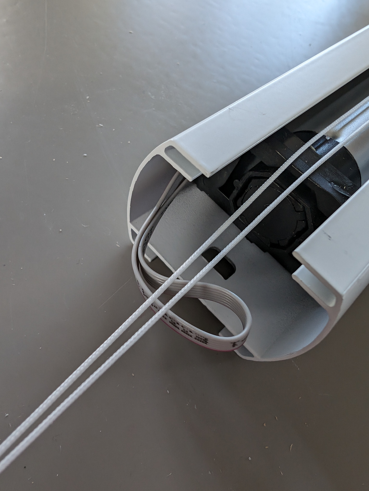
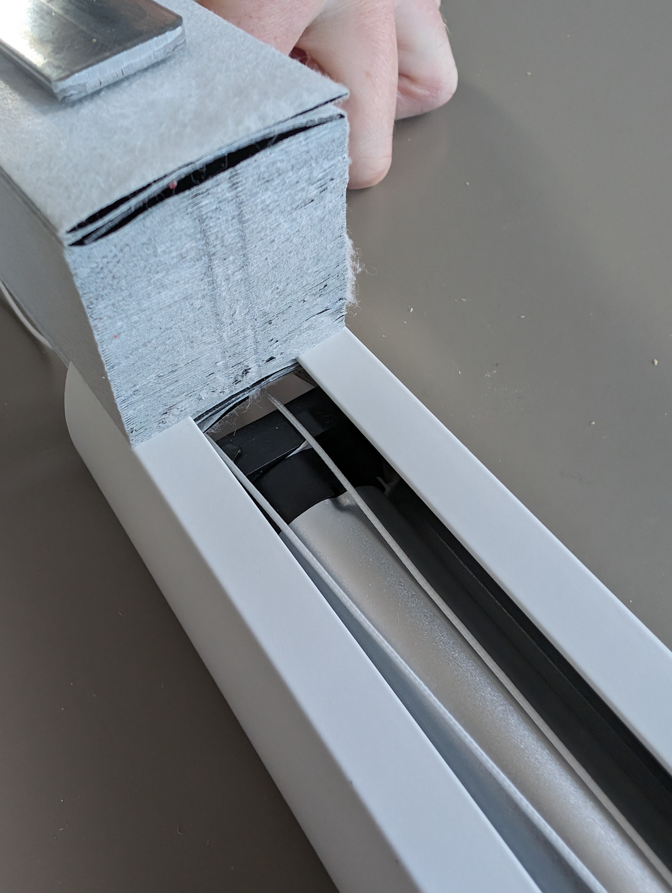

18. Reattach the end cap.
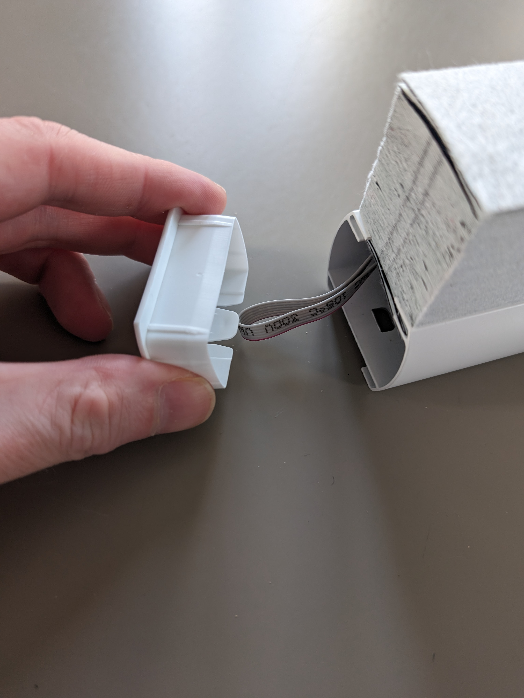

19. With the ropes fully extended (and of equal length), tie them together:
    - Lay everything on the floor.
    - Ensure the top assembly is stationary.
    - Manually extend the curtain to its full length.
    - Tie the rope ends together so they lay flat along the bottom, with the knot centered between the two new holes.
    
    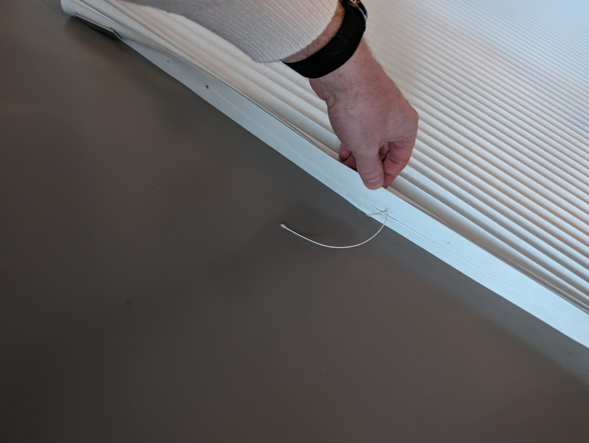
    

    - Trim any excess rope, or tuck it into the bottom iron holder.
20. Reattach the bottom iron holder, ensuring proper insertion of the second-to-last segment and the ropes.
21. Attach the plastic end cap to the bottom part.
22. Use the button to pull up the curtain; it should stop at the top.
23. Finished! If the curtain only descends a short distance after this modification, a factory reset (holding both buttons for ~5 seconds in the top position until it moves slightly) might resolve the issue.
